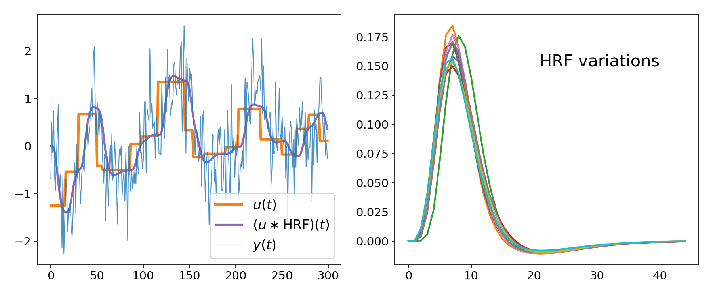
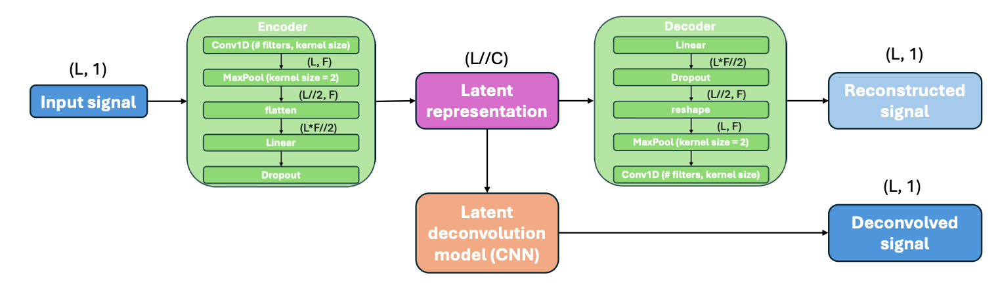
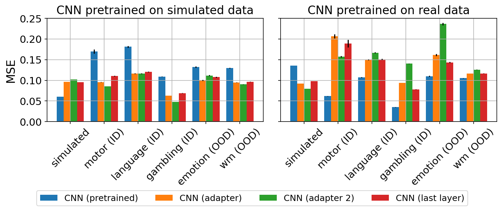
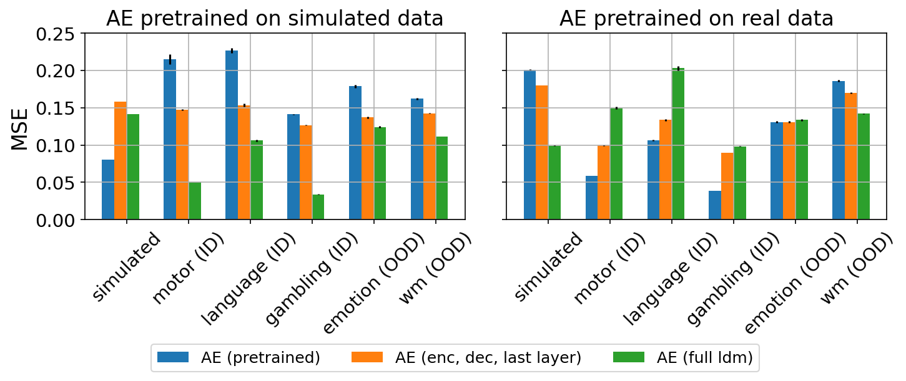
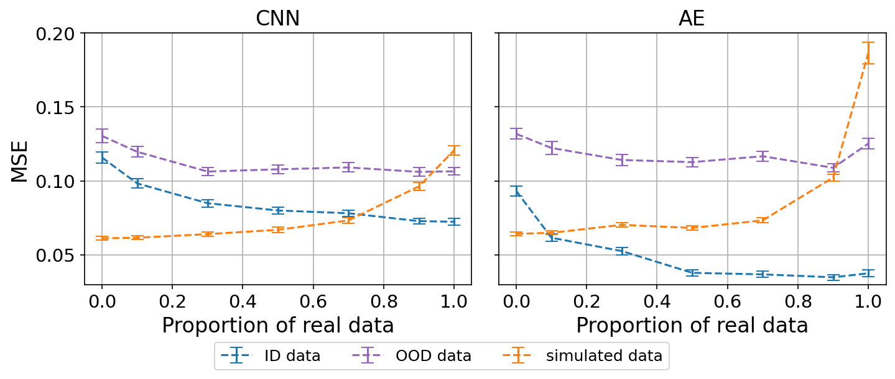
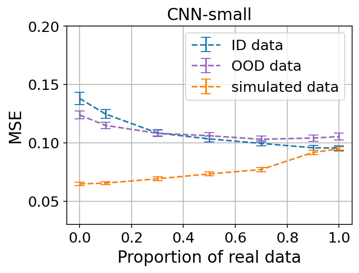

# Deconvolution of BOLD fMRI Signals using Neural Networks

## Overview

Functional MRI (fMRI) measures brain activity indirectly through the Blood-Oxygen-Level Dependent (BOLD) signal. Recovering the underlying neural activity from BOLD measurements requires solving an ill-posed deconvolution problem.

Traditional approaches (e.g., Wiener filtering, Total Activation) rely on assumptions about:
- Noise distributions
- Hemodynamic Response Function (HRF)
- Sparsity priors

In this project, I explored **data-driven alternatives** using neural networks to perform BOLD signal deconvolution without explicit modeling assumptions.

Two architectures are investigated:

- **Convolutional Neural Networks (CNNs)**
- **Autoencoders (AEs) with latent deconvolution module**

The project studies:

- Supervised training on real and simulated data
- Two-stage training (pretraining on simulated (respectively real) data → fine-tuning on real (respectively simulated) data)
- Mixed-domain training for generalization
- Model robustness to out-of-distribution (OOD) samples
- Physically constrained lightweight models

## Problem Formulation

The BOLD signal can be modeled as:

$y(t) = (u * \text{HRF})(t) + n(t)$

Where:
- $u(t)$: underlying activity-inducing neural signal (piecewise constant)
- HRF: hemodynamic response function
- $n(t)$: noise

The objective is to estimate $u(t)$ from observed $y(t)$.

## Datasets

### 1️⃣ Real Data – Human Connectome Project (HCP)

Task-based fMRI data from 100 subjects: motor, language, gambling, emotion, working memory

Several curation steps were performed by another lab member prior to the project. They include:
- Preprocessing: Motion correction, slice timing correction, registration to MNI space, grey matter masking, smoothing
- Target estimation using the general linear model
- Selection of only the statistically significant voxels for ensuring high quality input/target pairs (98th percentile F-statistic, R² > 0.1).

I used the prior curated dataset and performed the following additional data processing steps:
- Subject-level train/val/test split to reduce bias and leakage
- Data augmentation (temporal shift, amplitude scaling, noise injection)
- Zero-padding to fixed sequence length

Final dataset:
- ~980k ID samples (70 / 15 / 15 split, motor - language - gambling tasks only)
- ~250k OOD samples (emotion - working memory tasks only)

### 2️⃣ Simulated Data

To overcome lack of ground truth and improve generalization simulated samples were generated through:

- Constructing piecewise-constant neural signals
- Convolving them with variable SPM (Statistical Parametric Mapping) HRFs
- Adding Gaussian noise, matching real samples' SNR levels

This allowed to control the HRF variability, train on a larger volume of data, and have explicit ground truth access.

**Simulated sample (left), HRF variations (right)**

## Methodology

### Loss Function

To encourage piecewise-constant reconstructions, the loss used was the Mean Squared Error (MSE) with a Gaussian version of Total Variation (TV) regularization, penalizing smooth transitions while preserving sharp changes.

The Gaussian TV formulation follows the approach described in:
G. L. Zeng, *Better than the total variation regularization* International Journal of Biomedical Research & Practice, 2024

### Models

Hyperparameter searches were performed using Optuna (Tree-Structured Parzen Estimator) on the following architectures:

#### 1️⃣ Convolutional Neural Networks

- 1–4 convolutional layers
- Kernel size search: 5–90
- Filters per layer: 1–10
- Zero-padding to preserve signal length

### 2️⃣ Autoencoder with Latent Deconvolution Module

Architecture:

- Encoder: Conv1D → Pooling → FC → Dropout
- Decoder: Symmetric reconstruction
- Latent Deconvolution Module (LDM):
  - Fully connected expansion
  - 4-layer CNN

Sequential training:
1. Train encoder-decoder (reconstruction)
2. Freeze and train LDM (deconvolution)

**Autoencoder with LDM Architecture**  

## Training Strategy

Three main training paradigms were evaluated:

### 1️⃣ Simulated/Real Pretraining → Real/Simulated Fine-tuning

- Pretrain on simulated (respectively real) data
- Fine-tune using real (respectively simulated) samples using multiple adaptation strategies (adapters, partial freezing)

### 2️⃣ Mixed-Domain Training

Train on varying proportions of real vs simulated data:
- 0%, 10%, 30%, 50%, 70%, 100% real samples

### 3️⃣ Physically Constrained CNN

Train a 3-layer CNN whose architecture admits an effective field of view < 40 time points (HRF length), enforces biologically realistic temporal receptive field.

## Results

### Fine-Tuning Improves Real-Data Performance

Two-stage training (pretraining on simulated samples --> fine-tuning on real samples) reduced MSE on real tasks:

- Improvement on seen tasks (motor, language, gambling)
- CNN showed better generalization to OOD tasks compared to version trained on only real samples
- AE achieved lowest error on seen tasks but overfit more easily

### Mixed Training Improves Generalization

Training with as little as **30% real data** improved OOD performance while maintaining simulated performance.

### Physically constrained model fails to outperform bigger models

Smaller physically constrained CNN generalized better than bigger models, but did not outperform them.

**Performance of physically constrained CNN on mixed datasets**

## Takeaways

- Pretraining on simulated dataset improves real-data performance.
- Domain gap between synthetic and real fMRI is significant.
- CNNs provide better OOD robustness than autoencoders.
- Physically constrained models improve stability but reduce peak accuracy.
- Mixed-domain training is promising for improving generalization.

## Future Work

- Improved HRF variability modeling
- End-to-end training of AE with single composite loss
- Physically informed architecture constraints
- Extension to resting-state fMRI
- Interpretability analysis of latent representations

## Repository Structure
* `/configs/*` - Contains config files for the .py scripts.
* `/data_generation/` - Contains scripts used to generate real and simulated datasets
    - `mixed_data_generation.py` - Generate mixed (real + simulated) datasets of various proportions of real data.
    - `real_data_generation.py` - Generate real dataset.
    - `simulated_data_generation.py` - Generate simulated dataset.
* `/notebooks/` - Contains notebooks used for analyis.
    - `hp_search_results_analysis.ipynb`
    - `midterm_pres_plots.ipynb`
    - `report_plots.ipynb`
* `/tools/`
    - `./models/*` - Contains all neural network model classes.
    - `analysis.py` - Contains all functions used for plots and results analysis.
    - `custom_loss.py` - Loss functions.
    - `objective.py` - Optuna objectives for hyperparameter searches.
    - `preprocessing_functions.py` - Base preprocessing functions (including data augmentation functions).
    - `preprocessing_script.py` - Wrapper functions to preprocess real datasets.
    - `simulated_data.py` -  Functions to generate simulated datasets.
    - `training_functions.py` - Contains the main training loops.
    - `utils.py` - Utility functions.
* `cnn_small.py` - Train & finetune CNN-small model.
* `ft_ae.py` - Finetune AE model using different strategies.
* `hp_search.py` - Hyperparameter search script.
* `mixed_data_training.py` - Script for training models on mixed datasets with varying proportions of real data.
* `requirements.txt`

